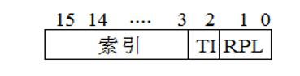

# Hello 的一生

1190501001 李恩宇

# 第 1 章 概述

## 1.1 Hello 简介

P2P (from program to process): `hello.c` 文件是通过文本编辑器编写, 存入文件系统中. `hello.c` 经过预处理器 `cpp` 预处理成 `hello.i`, 再经过编译器 `cc1` 变成 `hello.s`, 再经过汇编器 `as` 变成 `hello.o`, 最后经过连接器 `ld` 与 libc 进行链接, 最终变成 `hello` 可执行目标文件. Shell 通过键盘读取 `./hello` 命令, fork 子进程, 并使用 `execve` 加载 `./hello`, 最终 hello 变成了一个进程 (Process).

020 (i.e. from zero to zero): Shell 执行可执行目标文件 hello, 并创建一组新的代码, 数据, 堆和栈空间. 新的堆被初始化为 0. 执行 hello 的过程中, 堆和栈的大小发生变化. 在 hello 执行完成后, 父进程 shell 回收子进程 hello, IO 管理与信号也通过软硬结合, 输出到屏幕. 堆栈信息恢复到执行 hello 之前的状态, 也就是 020.

## 1.2 环境与工具

OS 环境:

```text
OS: Arch Linux x86_64
Host: VMware 16.1.0
Kernel: 5.12.12-arch1-1
Shell: zsh 5.8
CPU: Intel i7-8550U (4) @ 1.991GHz
```

软件/开发工具版本:

- gcc (GCC) 11.1.0

## 1.3 中间结果

| 文件          | 内容                                     |
| ------------- | ---------------------------------------- |
| `hello.i`     | 预处理过的源程序                         |
| `hello.s`     | 汇编程序                                 |
| `hello.o`     | 可重定位目标程序                         |
| `hello`       | 可执行程序                               |
| `hello_o.elf` | hello.o 通过 readelf 查看的 elf 结构文本 |
| `hello.elf`   | hello 通过 readelf 查看的 elf 结构文本   |
| `hello_o.asm` | hello.o 通过 objdump 查看的反汇编代码    |
| `hello.asm`   | hello 通过 objdump 查看的反汇编代码      |

## 1.4 本章小节

# 第 2 章 预处理

## 2.1 预处理的概念及作用

预处理器根据 # 开头的预处理指令, 修改原式的 C 程序. 常见的预处理指令包括 `#include`, `#define`, `#ifdef`, `#ifndef`, `#else` 等. 在 `hello.c` 中, 三条预处理指令为三条 `#include` 指令:

```c
#include <stdio.h>
#include <unistd.h>
#include <stdlib.h>
```

hello.c 经过预处理, 生成 hello.i 文件. 预处理的作用有:

1. `#include` 头文件的内容插入到程序文本中;
2. `#define` 定义 token, 并将 token 替换指定文本;
3. 删除所有注释;
4. 添加行号和文件标识符. 用于显示调试信息, 如编译错误和警告等;
5. 处理条件预编译指令, 如 `#ifdef` 等指令;

## 2.2 在 Linux 下预处理的命令

```zsh
gcc -E hello.c -o hello.i
```

## 2.3 Hello 的预处理结果解析

预处理文件结果共有 3065 行.

```c
# 0 "hello.c"
# 0 "<built-in>"
# 0 "<命令行>"
# 1 "/usr/include/stdc-predef.h" 1 3 4
# 0 "<命令行>" 2
# 1 "hello.c"

# 1 "/usr/include/stdio.h" 1 3 4
# 27 "/usr/include/stdio.h" 3 4
# 1 "/usr/include/bits/libc-header-start.h" 1 3 4
# 33 "/usr/include/bits/libc-header-start.h" 3 4
# 1 "/usr/include/features.h" 1 3 4
# 473 "/usr/include/features.h" 3 4
# 1 "/usr/include/sys/cdefs.h" 1 3 4
# 462 "/usr/include/sys/cdefs.h" 3 4
# 1 "/usr/include/bits/wordsize.h" 1 3 4
# 463 "/usr/include/sys/cdefs.h" 2 3 4
# 1 "/usr/include/bits/long-double.h" 1 3 4
# 464 "/usr/include/sys/cdefs.h" 2 3 4
# 474 "/usr/include/features.h" 2 3 4
# 497 "/usr/include/features.h" 3 4
# 1 "/usr/include/gnu/stubs.h" 1 3 4
# 10 "/usr/include/gnu/stubs.h" 3 4
# 1 "/usr/include/gnu/stubs-64.h" 1 3 4
# 11 "/usr/include/gnu/stubs.h" 2 3 4
# 498 "/usr/include/features.h" 2 3 4
# 34 "/usr/include/bits/libc-header-start.h" 2 3 4
# 28 "/usr/include/stdio.h" 2 3 4

/* omit some code */

typedef unsigned char __u_char;
typedef unsigned short int __u_short;
typedef unsigned int __u_int;
typedef unsigned long int __u_long;


typedef signed char __int8_t;
typedef unsigned char __uint8_t;
typedef signed short int __int16_t;
typedef unsigned short int __uint16_t;
typedef signed int __int32_t;
typedef unsigned int __uint32_t;

typedef signed long int __int64_t;
typedef unsigned long int __uint64_t;

/* omit some code */

struct _IO_FILE
{
  int _flags;


  char *_IO_read_ptr;
  char *_IO_read_end;
  char *_IO_read_base;
  char *_IO_write_base;
  char *_IO_write_ptr;
  char *_IO_write_end;
  char *_IO_buf_base;
  char *_IO_buf_end;


  char *_IO_save_base;
  char *_IO_backup_base;
  char *_IO_save_end;

  struct _IO_marker *_markers;
  /* omit some code */
}

/* omit some code */

extern int usleep (__useconds_t __useconds);
# 478 "/usr/include/unistd.h" 3 4
extern int pause (void);

/* omit some code */

# 10 "hello.c"
int main(int argc, char *argv[])
{
 int i;

 if (argc != 4)
 {
  printf("用法: Hello 学号 姓名 秒数！\n");
  exit(1);
 }
 for (i = 0; i < 8; i++)
 {
  printf("Hello %s %s\n", argv[1], argv[2]);
  sleep(atoi(argv[3]));
 }
 getchar();
 return 0;
}

```

我们发现:

1. 注释被删除
2. 头文件内容被插入到 `hello.i` 中.

gcc 打开 `stdio.h`, 递归处理 `stdio.h` 中的 `#include` 指令, 直到不存在 `#include` 指令.

## 2.4 本章小结

本阶段完成了 `hello.c` 的预处理过程. 预处理使程序在后续的操作中不受阻碍, 可以进行下一阶段的汇编处理.

# 第三章 编译

## 3.1 编译的概念与作用

编译是由编译器完成的第二步操作, 主要做词法分析, 语法分析和语义分析等, 在检查无错误后后, 把代码翻译成汇编语言, 生成 `.i` 文件即被汇编程序.

具体作用, 在于通过词法分析提取出基本字, 标识符, 常数, 运算符和界符, 然后通过语法分析分划出同类型作为整体, 再通过词义分析产生四元式的中间代码, 经过优化后, 开始存储空间分配, 寄存器的调度等复杂工作生成最终的目标代码.

## 3.2 在 Linux 下编译的命令

```zsh
gcc -S hello.i -o hello.s -fomit-frame-pointer -Og
```

## 3.3 Hello 的编译结果解析

### 3.3.1

```s
	.file	"hello.c"
	.text
	.section	.rodata.str1.8,"aMS",@progbits,1
	.align 8
.LC0:
	.string	"\347\224\250\346\263\225: Hello \345\255\246\345\217\267 \345\247\223\345\220\215 \347\247\222\346\225\260\357\274\201"
	.section	.rodata.str1.1,"aMS",@progbits,1
.LC1:
	.string	"Hello %s %s\n"
	.text
	.globl	main
	.type	main, @function
main:
.LFB6:
	.cfi_startproc
	pushq	%rbp
	.cfi_def_cfa_offset 16
	.cfi_offset 6, -16
	pushq	%rbx
	.cfi_def_cfa_offset 24
	.cfi_offset 3, -24
	subq	$8, %rsp
	.cfi_def_cfa_offset 32
	cmpl	$4, %edi
	jne	.L6
	movq	%rsi, %rbx
	movl	$0, %ebp
	jmp	.L2
.L6:
	leaq	.LC0(%rip), %rdi
	call	puts@PLT
	movl	$1, %edi
	call	exit@PLT
.L3:
	movq	16(%rbx), %rdx
	movq	8(%rbx), %rsi
	leaq	.LC1(%rip), %rdi
	movl	$0, %eax
	call	printf@PLT
	movq	24(%rbx), %rdi
	call	atoi@PLT
	movl	%eax, %edi
	call	sleep@PLT
	addl	$1, %ebp
.L2:
	cmpl	$7, %ebp
	jle	.L3
	call	getchar@PLT
	movl	$0, %eax
	addq	$8, %rsp
	.cfi_def_cfa_offset 24
	popq	%rbx
	.cfi_def_cfa_offset 16
	popq	%rbp
	.cfi_def_cfa_offset 8
	ret
	.cfi_endproc
.LFE6:
	.size	main, .-main
	.ident	"GCC: (GNU) 11.1.0"
	.section	.note.GNU-stack,"",@progbits
```

### 3.3.1 数据

#### 3.3.1.1 常量

对于字符串常量, 数据存储在 `.rodata` 段中. 在 `hello.c` 中, `"用法: Hello 学号 姓名 秒数！"` 和 `"Hello %s %s\n"` 存储在 `.rodata` 段中.

在函数中的数值字面常量被存储在 `.text`, 以指令的一部分存储. 常见的情况有立即数 (`movl $1, %edi`) 和地址计算.

#### 3.3.1.2 变量

已初始化为非零的全局变量和静态局部变量存储在 .data 段中, 未初始化和初始化为 0 的全局变量和静态局部变量存储在 `.bss` 段中. 在 `hello.c` 中, 并不存在这两类变量.

局部变量存储在寄存器或栈上. 比如, 循环变量 `i` 就存储在 `%ebp` 寄存器中.

### 3.3.2 表达式

表达式的值存储在寄存器或栈上, 具体存储位置取决于指令类型和指令参数.

### 3.3.3 类型

有符号整数在编译后表示为补码形式, 在 `hello.c` 中没有体现. 不同大小的整数在同一个表达式里也需要转换, `hello.c` 中没有体现.

### 3.3.4 赋值

全局变量或静态变量赋初值, 表示将其放在 .data 段中. 若不赋初值, 则放在 `.bss` 段中. 在 `hello.c` 中没有体现.

剩下的赋值语句等效于 `mov` 指令, 也可能是某些运算指令的写回/访存阶段. 如 `i = 0` 对应 `movl $0, %ebp`.

### 3.3.5 算术操作

`++` / `--` 符号等价于 `+= 1` / `-= 1`. 此处的算术操作仅有 `i++`, 对应 `addl $1, %rbp`.

### 3.3.6 关系操作

`cmpl %rA, %rB` 表示计算 `%rB - %rA`, 设置 `CC`, 但不保存结果.

`!=` 对应的是 `cmpl` 指令, 检测结果是否为零. `argc != 4` 对应汇编语句 `cmpl $4, %edi` 并用不相等跳转.

`<` 对应的也是 `cmpl` 指令, 检测结果是否有符号. `i < 8` 对应汇编语句 `cmpl $7, %ebp` 并用小于等于跳转.

### 3.3.7 数组操作

数组操作包括取 `argv` 中的元素, 通过 `movq` 实现, 如取 `argv[3]`, 汇编指令为 `movq 24(%rbx), %rdi`, 其中 `%rbx` 为 `argv` 的值. 前面的 `24` 是 `3 * sizeof(char *)`.

### 3.3.8 控制转移

通常是先执行 `cmpx`, 然后执行 `jxx` 实现条件跳转. 在与之相反的分支, 执行无条件跳转.

对于 `if (argc != 4)`, 编译生成

```s
	cmpl	$4, %edi
	jne	.L6
	<body code>
	jmp	.L2
```

对于 `for (i = 0; i < 8; i++)`, 编译生成

```s
  cmpl	$7, %ebp
	jle	.L3
```

### 3.3.9 函数调用

函数调用的前三个参数通过 `%rdi`, `%rsi`, `%rdx` 传递. 函数调用的返回值存储在 %rax 中. 调用函数时, 先设置参数, 随后执行 `callq` 指令. 该指令将下一条指令地址压栈, 并将 `%rip` 设置为要调用的函数的地址.

如, `printf("Hello %s %s\n", argv[1], argv[2]);`, 对应汇编指令为

```s
	movq	16(%rbx), %rdx
	movq	8(%rbx), %rsi
	leaq	.LC1(%rip), %rdi
	movl	$0, %eax
	call	printf@PLT
```

## 3.4 本章小节

编译器通过编译将修改了的源程序编译成汇编程序. 本章对比 C 语言的语句和汇编语句, 理解了汇编语言不同语句的具体含义, 以及不同数据类型的操作与存储.

# 第 4 章 汇编

## 4.1 汇编的概念与作用

把汇编语言翻译成机器语言的过程称为汇编.

作用: 汇编器是将汇编代码 (.s) 转变成机器可以识别的机器指令, 并将这些指令打包成可
重定位目标程序 (.o). .o 文件是一个二进制文件.

## 4.2 在 Linux 下汇编的命令

```zsh
gcc -c hello.s -o hello.o
```

## 4.3 可重定位目标 ELF 格式

| 段        | 功能                                          |
| --------- | --------------------------------------------- |
| ELF 头    | 描述生成该文件的系统字的大小和字节顺序        |
| .text     | 已编译程序的机器代码                          |
| .rodata   | 只读数据                                      |
| .data     | 已初始化的全局和静态 C 变量                   |
| .bss      | 未初始化或初始化为 0 的全局和静态 C 变量      |
| .symtab   | 存放程序中定义和引用的函数和全局变量信息      |
| .rel.text | 一个 .text 节中位置的列表                     |
| .rel.data | 被模块引用或定义的所有全局变量的重定位信息    |
| .debug    | 条目是局部变量, 类型定义, 全局变量及 C 源文件 |
| .line     | C 源程序中行号和 .text 节机器指令的映射       |
| .strtab   | .symtab 和 .debug 中符号表及节头部中节的名字  |
| 节头部表  | 描述目标文件的节                              |

readelf 命令格式

```zsh
readelf --all hello.o > hello_o.elf
```

### 4.3.1 ELF header

```text
ELF Header:
  Magic:   7f 45 4c 46 02 01 01 00 00 00 00 00 00 00 00 00
  Class:                             ELF64
  Data:                              2's complement, little endian
  Version:                           1 (current)
  OS/ABI:                            UNIX - System V
  ABI Version:                       0
  Type:                              REL (Relocatable file)
  Machine:                           Advanced Micro Devices X86-64
  Version:                           0x1
  Entry point address:               0x0
  Start of program headers:          0 (bytes into file)
  Start of section headers:          1216 (bytes into file)
  Flags:                             0x0
  Size of this header:               64 (bytes)
  Size of program headers:           0 (bytes)
  Number of program headers:         0
  Size of section headers:           64 (bytes)
  Number of section headers:         14
  Section header string table index: 13
```

- Magic: 供操作系统辨认使用
- Type: 文件类型 (REL/EXE)
- OS: 操作系统
- Machine: 架构
- Version: ELF 版本, 目前均为 1
- Entry: 程序的入口地址. .o 文件没有入口, 故为 0
- Size / number of section headers: 节头部表中条目的大小和数量

### 4.3.2 Section Headers

节头部表, 包含了文件中出现的各个节的语义, 节的类型, 位置, 偏移量和大小等信息.

```text
Section Headers:
  [Nr] Name              Type             Address           Offset
       Size              EntSize          Flags  Link  Info  Align
  [ 0]                   NULL             0000000000000000  00000000
       0000000000000000  0000000000000000           0     0     0
  [ 1] .text             PROGBITS         0000000000000000  00000040
       000000000000006d  0000000000000000  AX       0     0     1
  [ 2] .rela.text        RELA             0000000000000000  00000370
       00000000000000c0  0000000000000018   I      11     1     8
  [ 3] .data             PROGBITS         0000000000000000  000000ad
       0000000000000000  0000000000000000  WA       0     0     1
  [ 4] .bss              NOBITS           0000000000000000  000000ad
       0000000000000000  0000000000000000  WA       0     0     1
  [ 5] .rodata.str1.8    PROGBITS         0000000000000000  000000b0
       0000000000000026  0000000000000001 AMS       0     0     8
  [ 6] .rodata.str1.1    PROGBITS         0000000000000000  000000d6
       000000000000000d  0000000000000001 AMS       0     0     1
  [ 7] .comment          PROGBITS         0000000000000000  000000e3
       0000000000000013  0000000000000001  MS       0     0     1
  [ 8] .note.GNU-stack   PROGBITS         0000000000000000  000000f6
       0000000000000000  0000000000000000           0     0     1
  [ 9] .eh_frame         PROGBITS         0000000000000000  000000f8
       0000000000000040  0000000000000000   A       0     0     8
  [10] .rela.eh_frame    RELA             0000000000000000  00000430
       0000000000000018  0000000000000018   I      11     9     8
  [11] .symtab           SYMTAB           0000000000000000  00000138
       00000000000001e0  0000000000000018          12    12     8
  [12] .strtab           STRTAB           0000000000000000  00000318
       0000000000000052  0000000000000000           0     0     1
  [13] .shstrtab         STRTAB           0000000000000000  00000448
       0000000000000077  0000000000000000           0     0     1
Key to Flags:
  W (write), A (alloc), X (execute), M (merge), S (strings), I (info),
  L (link order), O (extra OS processing required), G (group), T (TLS),
  C (compressed), x (unknown), o (OS specific), E (exclude),
  l (large), p (processor specific)
```

### 4.3.3 重定位节 .rela.text

```text
Relocation section '.rela.text' at offset 0x370 contains 8 entries:
  Offset          Info           Type           Sym. Value    Sym. Name + Addend
000000000018  000900000002 R_X86_64_PC32     0000000000000000 .LC0 - 4
00000000001d  000e00000004 R_X86_64_PLT32    0000000000000000 puts - 4
000000000027  000f00000004 R_X86_64_PLT32    0000000000000000 exit - 4
000000000036  000a00000002 R_X86_64_PC32     0000000000000000 .LC1 - 4
000000000040  001000000004 R_X86_64_PLT32    0000000000000000 printf - 4
000000000049  001100000004 R_X86_64_PLT32    0000000000000000 atoi - 4
000000000050  001200000004 R_X86_64_PLT32    0000000000000000 sleep - 4
00000000005d  001300000004 R_X86_64_PLT32    0000000000000000 getchar - 4
```

这一步生成的可重定向目标文件由于未和标准 C library 链接, 因此有些信息需要修改, 如代码节, 数据节中的对每个符号的引用. 我们在 .rela.text 节中记录这些需要修改的地址. .rela.text 中每个条目维护这些信息:

| 信息   | 含义                                                                                                                                            |
| ------ | ----------------------------------------------------------------------------------------------------------------------------------------------- |
| Offset | 要修改的引用相对于 .text 或 .data 节头的偏移量                                                                                                  |
| Info   | 8 Byte. 前 4 Byte 是 symbol, 代表重定位到的目标在 .symtab 中的偏移量. 后 4 Byte 是 type, 是重定位类型 (有 R_X86_64_PC32 和 R_X86_64_PLT32 两种) |
| Addend | 计算重定位位置的辅助信息, 共占 8 个字节                                                                                                         |
| Name   | 重定向到的目标的名称                                                                                                                            |

hello.o 的 .rela.text 节中维护了这些条目: .LC0 (第一个 printf 中的字符串), puts 函
数, exit 函数, .LC1 (第二个 printf 中的字符串), printf 函数, atoi 函数, sleep 函
数, getchar 函数.

### 4.3.4 .symtab

符号表, 用来存放程序中定义和引用的函数和全局变量的信息. 重定位需要引用的符号都在其中声明.

```text
Symbol table '.symtab' contains 20 entries:
   Num:    Value          Size Type    Bind   Vis      Ndx Name
     0: 0000000000000000     0 NOTYPE  LOCAL  DEFAULT  UND
     1: 0000000000000000     0 FILE    LOCAL  DEFAULT  ABS hello.c
     2: 0000000000000000     0 SECTION LOCAL  DEFAULT    1
     3: 0000000000000000     0 SECTION LOCAL  DEFAULT    3
     4: 0000000000000000     0 SECTION LOCAL  DEFAULT    4
     5: 0000000000000000     0 SECTION LOCAL  DEFAULT    5
     6: 0000000000000000     0 SECTION LOCAL  DEFAULT    6
     7: 0000000000000000     0 SECTION LOCAL  DEFAULT    8
     8: 0000000000000000     0 SECTION LOCAL  DEFAULT    9
     9: 0000000000000000     0 NOTYPE  LOCAL  DEFAULT    5 .LC0
    10: 0000000000000000     0 NOTYPE  LOCAL  DEFAULT    6 .LC1
    11: 0000000000000000     0 SECTION LOCAL  DEFAULT    7
    12: 0000000000000000   109 FUNC    GLOBAL DEFAULT    1 main
    13: 0000000000000000     0 NOTYPE  GLOBAL DEFAULT  UND _GLOBAL_OFFSET_TABLE_
    14: 0000000000000000     0 NOTYPE  GLOBAL DEFAULT  UND puts
    15: 0000000000000000     0 NOTYPE  GLOBAL DEFAULT  UND exit
    16: 0000000000000000     0 NOTYPE  GLOBAL DEFAULT  UND printf
    17: 0000000000000000     0 NOTYPE  GLOBAL DEFAULT  UND atoi
    18: 0000000000000000     0 NOTYPE  GLOBAL DEFAULT  UND sleep
    19: 0000000000000000     0 NOTYPE  GLOBAL DEFAULT  UND getchar
```

## 4.4 Hello.o 的结果解析

将 hello.o 进行反汇编:

```zsh
objdump -d -r hello.o > hello_o.asm
```

对比 hello.s 和 hello_o.asm

### 4.4.1 分支转移

在 hello.s 中:

```s
  jne	.L6
  <some code>
  jmp .L2
```

在 hello_o.asm 中

```s
   9:	75 0a                	jne    15 <main+0x15>
	 <some code>
  13:	eb 42                	jmp    57 <main+0x57>
```

反汇编代码跳转指令的使用的是相对地址 (相对 .text 段的地址), 而 hello.s 中用的是段符号 .L6, .L2 等等. 例如 hello.s 中的 jne .L6 对应反汇编代码中的 jne 15. 因为段名称只是在汇编语言中便于编写的助记符, 所以在汇编成机器语言之后显然不存在, 而是确定的地址.

### 4.4.2 函数调用

在 hello.s 中:

```s
	call	exit@PLT
```

在 hello_o.asm 中

```s
  26:	e8 00 00 00 00       	callq  2b <main+0x2b>
```

在 .s 文件中, call 指令后直接跟着函数名称, 而在反汇编程序中, call 的目标地址是当前下一条指令的地址. 例如 hello.s 中的 `call exit@plt` 对应反汇编代码中的 `call 2b`. 这是因为由于我们调用的函数是来自外部的函数, 所以 hello.o 和标准库链接 时需要重定位计算地址, 我们现在无法知道最终运行时的地址, 所以用 0 来填充. `call` 指令对应的机器代码的编码室 `e8`, 我们在后面填充 4 字节的 0. 又由于 `call` 指令采用相对寻址(相对 `%rip`), 所以我们用 0 填充, 相当于 call 下一条指令. 在链接时根据 .rela.text 中的内容再加以修正.

### 4.4.3 全局变量的引用

在 hello.s 中, 全局变量用全局变量名称 (%rip) 来引用, 而在反汇编代码中, 我们用 0x0(%rip). 和函数调用的原理类似, 我们由于不知道全局变量在最终链接后的地址, 我们暂时用 0 来填充. 在链接时根据 .rela.text 中的内容再加以修正.

### 4.5 本章小节

本章通过使用 readelf 和 objdump 辅助工具查看了可重定向目标文件 hello.o 的 elf 结构和反汇编代码. 通过 objdump 还可以反汇编查看二进制文件的汇编代码和机器代码及其对应关系.

# 第 5 章 链接

## 5.1 链接的概念与作用

链接是将各种代码和数据片段收集并组合成一个单一文件的过程, 这个文件可被加载到内存并执行.
链接的作用是将不可执行的可重定向目标文件变成可执行的目标文件。

## 5.2 在 Linux 下链接的命令

```zsh
ld -o hello -dynamic-linker /lib64/ld-linux-x86-64.so.2 /usr/lib/x86_64-linux-gnu/crt1.o /usr/lib/x86_64-linux-gnu/crti.o hello.o /usr/lib/x86_64-linux-gnu/libc.so /usr/lib/x86_64-linux-gnu/crtn.o
```

## 5.3 可执行目标文件 hello 的格式

readelf 命令格式

```zsh
readelf --all hello > hello.elf
```

### 5.3.1 ELF header

和 hello.o 的 ELF header 结构类似, 不过 section 的个数不同.

```text
ELF Header:
  Magic:   7f 45 4c 46 02 01 01 00 00 00 00 00 00 00 00 00
  Class:                             ELF64
  Data:                              2's complement, little endian
  Version:                           1 (current)
  OS/ABI:                            UNIX - System V
  ABI Version:                       0
  Type:                              EXEC (Executable file)
  Machine:                           Advanced Micro Devices X86-64
  Version:                           0x1
  Entry point address:               0x401090
  Start of program headers:          64 (bytes into file)
  Start of section headers:          14104 (bytes into file)
  Flags:                             0x0
  Size of this header:               64 (bytes)
  Size of program headers:           56 (bytes)
  Number of program headers:         10
  Size of section headers:           64 (bytes)
  Number of section headers:         25
  Section header string table index: 24
```

### 5.3.2 Section Headers

```text
Section Headers:
  [Nr] Name              Type             Address           Offset
       Size              EntSize          Flags  Link  Info  Align
  [ 0]                   NULL             0000000000000000  00000000
       0000000000000000  0000000000000000           0     0     0
  [ 1] .interp           PROGBITS         0000000000400270  00000270
       000000000000001c  0000000000000000   A       0     0     1
  [ 2] .note.ABI-tag     NOTE             000000000040028c  0000028c
       0000000000000020  0000000000000000   A       0     0     4
  [ 3] .hash             HASH             00000000004002b0  000002b0
       0000000000000038  0000000000000004   A       5     0     8
  [ 4] .gnu.hash         GNU_HASH         00000000004002e8  000002e8
       000000000000001c  0000000000000000   A       5     0     8
  [ 5] .dynsym           DYNSYM           0000000000400308  00000308
       00000000000000d8  0000000000000018   A       6     1     8
  [ 6] .dynstr           STRTAB           00000000004003e0  000003e0
       000000000000005c  0000000000000000   A       0     0     1
  [ 7] .gnu.version      VERSYM           000000000040043c  0000043c
       0000000000000012  0000000000000002   A       5     0     2
  [ 8] .gnu.version_r    VERNEED          0000000000400450  00000450
       0000000000000020  0000000000000000   A       6     1     8
  [ 9] .rela.dyn         RELA             0000000000400470  00000470
       0000000000000030  0000000000000018   A       5     0     8
  [10] .rela.plt         RELA             00000000004004a0  000004a0
       0000000000000090  0000000000000018  AI       5    19     8
  [11] .init             PROGBITS         0000000000401000  00001000
       0000000000000017  0000000000000000  AX       0     0     4
  [12] .plt              PROGBITS         0000000000401020  00001020
       0000000000000070  0000000000000010  AX       0     0     16
  [13] .text             PROGBITS         0000000000401090  00001090
       0000000000000101  0000000000000000  AX       0     0     16
  [14] .fini             PROGBITS         0000000000401194  00001194
       0000000000000009  0000000000000000  AX       0     0     4
  [15] .rodata           PROGBITS         0000000000402000  00002000
       000000000000003d  0000000000000000   A       0     0     8
  [16] .eh_frame         PROGBITS         0000000000402040  00002040
       0000000000000104  0000000000000000   A       0     0     8
  [17] .dynamic          DYNAMIC          0000000000403e50  00002e50
       00000000000001a0  0000000000000010  WA       6     0     8
  [18] .got              PROGBITS         0000000000403ff0  00002ff0
       0000000000000010  0000000000000008  WA       0     0     8
  [19] .got.plt          PROGBITS         0000000000404000  00003000
       0000000000000048  0000000000000008  WA       0     0     8
  [20] .data             PROGBITS         0000000000404048  00003048
       0000000000000004  0000000000000000  WA       0     0     1
  [21] .comment          PROGBITS         0000000000000000  0000304c
       0000000000000012  0000000000000001  MS       0     0     1
  [22] .symtab           SYMTAB           0000000000000000  00003060
       0000000000000498  0000000000000018          23    28     8
  [23] .strtab           STRTAB           0000000000000000  000034f8
       0000000000000158  0000000000000000           0     0     1
  [24] .shstrtab         STRTAB           0000000000000000  00003650
       00000000000000c5  0000000000000000           0     0     1
Key to Flags:
  W (write), A (alloc), X (execute), M (merge), S (strings), I (info),
  L (link order), O (extra OS processing required), G (group), T (TLS),
  C (compressed), x (unknown), o (OS specific), E (exclude),
  l (large), p (processor specific)
```

# 第 6 章 hello 进程管理

## 6.1 进程的概念和作用

进程是一个执行中的程序的实例, 每一个进程都有它自己的地址空间, 一般情况下, 包括文本区域, 数据区域, 和堆栈. 文本区域存储处理器执行的代码; 数据区域存储变量和进程执行期间使用的动态分配的内存; 堆栈区域存储区着活动过程调用的指令和本地变量.

作用: 通过上下文切换, 可以让 cpu 有一种同时运行很多可执行文件的假象, 然而实际上是几个程序来回切换着占着 cpu.

## 6.2 简述壳 Shell-bash 的作用与处理流程

Shell 的作用: Shell 是一个用高级语言编写的交互型的应用级程序. 用户可以通过键入命令来和 linux 系统互动.

Shell 的处理流程:

1. 分析用户输入
2. 分析输入内容, 获得参数
3. 如果是内核命令直接执行, 否则调用相应的程序执行命令
4. 在程序运行期间, shell 需要监视键盘的输入内容, 并且做出相应的反应
5. 如果是前台程序, 程序结束需要回收

## 6.3 Hello 的 fork 进程创建过程

shell 首先 fork 一个子进程, 这个子进程是父进程的一个副本, 有着和父进程相同的堆栈结构, 堆栈存储信息,寄存器信息等等, 虚拟地址相同但独立.

父进程与子进程是并发运行的独立进程, 内核能够以任意方式交替执行它们的逻辑控制流的指令. 如果通过分析命令行键入信息得知是前台程序. 则在子进程执行期间, 父进程 (shell) 等待子进程的完成, 回收子进程. 如指定为后台程序, 则无需等待子进程完成.

## 6.4 Hello 的 execve 过程

fork 之后, 我们就要在子进程中 execve (加载) hello 这个进程了. execve 时还要传入命令行参数. 就是 hello 中的学号, 姓名, 秒数.

加载并运行 hello 需要以下几个步骤:

1. 删除已存在的用户区域
2. 映射私有区域
3. 映射贡献区域
4. 设置程序计数器

execve 函数加载并运行可执行文件 hello, 且带参数列表 argv 和环境变量列表 envp. argv 变量指向一个以 null 结尾的指针数组, 每一个指针都指向一个参数字符串. envp 变量指向一个以变量指向一个以 null 结尾的指针数组, 每个指针指向一个环境变量字符串.

## 6.5 Hello 的执行

### 6.5.1 sleep()

sleep()方法是线程类 (Thread) 的静态方法, 让调用的线程进入指定时间睡眠状态, 使得当前线程进入阻塞状态, 告诉系统至少在指定时间内不需要为线程调度器为该线程分配执行时间片, 不再占用 cpu, 给执行机会给其他线程, 但是监控状态依然保持, 到时后会自动恢复.

### 6.5.2 上下文切换

如图所示, 简单理解就是两个进程来回切换的过程, 这样才会给我们一个程序独占 cpu 的错觉. 两个程序需要内核的介入完成上下文切换.


### 6.5.3 进程 hello

在 hello 加载完成之后, hello 就要开始执行了. 但是 cpu 只有一个, 还有其他进程也在运行, 比如再打开一个 shell 等等. 这是我们就要运用上下文切换. 就在这种来回切换的过程中, hello 执行到了 sleep() 命令, 系统得知 ns 内不需要分配时间片给 hello 了, 此时进入内核状态执行中断处理, 将 hello 进程从等待队列中移出重新加入到运行队列, 成为就绪状态, hello 进程就可以继续进行自己的控制逻辑流了.

## 6.6 hello 的异常与信号处理

### 6.6.1 信号的种类

- SIGTSTP
- SIGCONT
- SIGINT

### 6.6.2 Ctrl + C


键入 Ctrl + C 向进程发送了一个 SIGINT 信号, 让进程直接结束.

### 6.6.3 Ctrl + Z


键入 Ctrl + Z 向进程发送了一个 SIGTSTP 信号, 让进程暂时挂起, 输入 ps 命令符发现 hello 进程依旧在运行.

### 6.6.4 fg


键入 fg 可以使后台挂起的进程继续运行. 先输出了 4 次, 然后 Ctrl + Z 挂起之后, fg 命令又可以让他继续进行, 然后把剩下的 4 次输出完.

### 6.6.5 jobs


jobs 命令可以查看当前 Shell 中所有的任务. 包括已挂起的和后台运行的.

### 6.6.6 pstree


pstree 是用进程树的方法把各个进程用树状图的方式显示出来.

### 6.6.7 kill


kill 命令向指定进程发送指定信号, 进程接收到信号后会做出对应的反应.

### 6.7 本章小结

本章介绍进程的概念与作用, 简述了壳 Shell 的作用与处理流程, 介绍 hello 的 fork 进程创建过程, hello 的 execve 过程和 hello 的进程执行. 还解析了在执行 hello 时各种异常与信号处理.

# 第 7 章 hello 的存储管理

## 7.1 hello 的存储器地址空间

逻辑地址: 逻辑地址是指由程序产生的与段相关的偏移地址部分. hello.o 里面的相对偏移地址就是逻辑地址.

线性地址: 地址空间是一个非负整数地址的有序集合, 如果地址空间中的整数是连续的, 那么我们说它是一个线性地址空间. 就是 hello 里面的虚拟内存地址.

虚拟地址: CPU 通过生成一个虚拟地址. 就是 hello 里面的虚拟内存地址. CSAPP 上讲的虚拟地址就是线性地址.

物理地址: 用于内存芯片级的单元寻址, 与处理器和 CPU 连接的地址总线相对应. 计算机系统的主存被组织成一个由 M 个连续的字节大小的单元组成的数组. 每字节都有一个唯一的物理地址. 就是 hello 在运行时虚拟内存地址对应的物理地址.

## 7.2 Intel 逻辑地址到线性地址的变换-段式管理


首先, 给定一个完整的逻辑地址 [段选择符 : 段内偏移地址], 段选择符的结构如下:



1. 看段选择符的 T1 (段描述符的判别符) = 0 还是 1, 知道当前要转换是 GDT (全局段描述符) 中的段, 还是 LDT (局部段描述符) 中的段, 再根据相应寄存器, 得到其地址和大小. 我们就有了一个数组了.
2. 拿出段选择符中前 13 位, 可以在这个数组中, 查找到对应的段描述符, 这样, 它的 Base, 即基地址就知道了.
3. 把 Base + offset, 就是要转换的线性地址了.

## 7.3 Hello 的线性地址到物理地址的变换-页式管理


从线性地址到物理地址的变换通过页式管理实现. 虚拟内存被组织为一个由存放在磁盘上的 N 个连续的字节大小的单元组成的数组. 每字节都有一个唯一的虚拟地址. 磁盘上数组的内容被缓存在主存中. 虚拟页是带虚拟内存系统将虚拟内存分割为大小固定的块, 作为磁盘和主存 (较高层) 之间的传输单元. VM 系统通过将虚拟内存分割成虚拟虚拟页的大小固定的块来解决. 任意时刻, 虚拟页面的集合分为三个不相交的子集: 未分配的, 缓存的, 未缓存的.


页表就是一个页表条目的数组. 虚拟地址空间中的每个页在页表中一个固定偏移量出都有一个 PTE. 每个 PTE 由一个有效位和一个 n 位地址字段组成. 有效位表面该虚拟页是否缓存在 DRAM 中, 如果设置了有效位, 那么地址字段就表示 DRAM 中相应的物理页的起始位置, 这个物理页中缓存了该虚拟页, 如果没有有效位, 若是空地址就表明未分配, 否则就执行该虚拟页在磁盘上的起始位置.


其中 VPO = PPO, 也就是一个引用相对于虚拟页的偏移量和相对于物理页的偏移量相等. 由虚拟地址变为物理地址需要 MMU 来进行翻译. 当有效位为 1 时, 我们直接在页表中找到对应的物理页号 PPN, , PPN + VPO 就是 PPN + PPO 也就是物理地址了. 当有效位为 0 时, 说明内存中不存在当前页, 此时 MMU 会选择一个内存中的页为牺牲页, 用当前页代替这个牺牲页, 更改页表信息, 完成这次读取.

## 7.4 TLB 与四级页表支持下的 VA 到 PA 的变换

### 7.4.1 TLB

每次 CPU 产生一个虚拟地址, MMU 就必须查阅一个 PTE, 这样我们就需要从内存中读取数据. 为了减少时间开销, 设计了 TLB. TLB 是一个关于 PTE 的缓存, 是 CPU 的一部分. TLB 是一个小的, 虚拟寻址的缓存, 其每一行都保存着一个由单个 PTE 组成的块. 结构如下图: 其中 TLB 是标记位, TLB 是组索引, VPO 是虚拟页偏移量.


其中位组数 T=2^t, 页表大小 P=2^p, 虚拟地址 n 位额的一个 TLB 的结构. 下图是 TLB 命中与不命中的两种情况.


TLB 命中时, 我们从硬件结构 TLB 中读取页表信息就可以了. TLB 不命中时, 我们只能从内存中读取, 然后更新 TLB 即可.

### 7.4.2 四级页表

下图给出了 Core i7 MMU 如何使用四级的页表来将虚拟地址翻译成物理地址. 36 位 VPN 被划分成四个 9 位的片, 每个片被用作到一个页表的偏移量. CR3 寄存器包含 Ll 页表的物理地址. VPN 1 提供到一个 Ll PET 的偏移量, 这个 PTE 包含 L2 页表的基地址. VPN 2 提供到一个 L2 PTE 的偏移量, 以此类推.


### 7.5 三级 Cache 支持下的物理内存访问


在上一步中我们获得了物理地址 VA, 如上图所示, 使用 CI 进行组索引, 每组 8 路, 对 8 路的块分别匹配 CT 如果匹配成功且块的 valid 标志位为 1, 则命中, 根据数据偏移量 CO 取出数据返回.

如果没有匹配成功或者匹配成功但是标志位是 1, 则不命中, 向下一级缓存中查询数据. 查询到数据之后, 一种简单的放置策略如下: 如果映射到的组内有空闲块, 则直接放置, 否则组内都是有效块, 产生冲突, 则采用某种策略进行替换.

## 7.6 hello 进程 fork 时的内存映射

当 fork 被调用时, 内核会为新进程创建各种数据结构, 并分配给它一个唯一的
PID, 为了给这个新进程创建虚拟内存, 它创建了当前进程的 mm_struct, 区域结
构和页表的原样副本. 它将这两个进程的每个页面都标记为只读, 并将两个进程
中的每个区域结构都标记为私有的写时复制.

## 7.7 hello 进程 execve 时的内存映射

加载并运行 hello 需要以下几个步骤:

1. 删除已存在的用户区域. 删除当前进程虚拟地址的用户部分中的已存在的区域结构.
2. 映射私有区域. 新程序的代码, 数据, bss 和栈区域创建新的区域结构, 所有这些新的区域都是私有的, 写时复制的. 代码和数据区域被映射为 hello.out 文件中的 .text 和 .data 区. .bss 区域是请求二进制零的, 映射到匿名文件, 其大小包含在 hello.out 中, 栈和堆地址也是请求二进制零的, 初始长度为零.
3. 映射贡献区域. 如果 hello.out 程序与共享对象 (或目标) 链接, 比如标准 C 库 libc.so, 那么这些对象都是动态链接到这个程序的, 然后再映射到用户虚拟地址空间中的共享区域内.
4. 设置程序计数器. execve 做的最后一件事情就是设置当前进程上下文的程序计数器, 使之指向代码区域的入口点.

execve 函数加载并运行可执行文件 hello. 且带参数列表 argv 和环境变量列表 envp. argv 变量指向一个以 null 结尾的指针数组, 每一个指针都指向一个参数字符串. envp 变量指向一个以变量指向一个以 null 结尾的指针数组, 每个指针指向一个环境变量字符串.

## 7.8 缺页故障与缺页中断处理

当发生缺页故障时, MMU 向 CPU 发送异常信号, 触发缺页故障, 将虚拟内存的页加载进物理内存中. 如果物理页没有空闲, 则根据某种替换策略牺牲掉已经在物理内存中的页. 如果被牺牲的页曾被写入, 还要将牺牲的页写回虚拟内存页. 当缺页故障处理完成后, 重新执行导致缺页的命令. 此时, 该命令需要的内存页已经被载入物理内存, 因此不会再出发缺页异常.

## 7.9 动态存储分配管理

## 7.9.1 动态内存分配器

动态内存分配器维护着一个进程的虚拟内存区域, 称为堆 (heap). 系统之间细节不同, 但是不失通用性, 假设堆是一个请求二进制零的区域, 它紧接在未初始化的数据区域后开始, 并向上生长 (向更高的地址). 对于每个进程, 内核维护着一个变量 brk, 它指向堆的顶部.

分配器将堆视为一组不同大小的块 (block) 的集合来维护. 每个块就是一个连续的虚拟内存片 (chunk), 要么是已分配的, 要么是空闲的. 已分配的块显式地保留为供应用程序使用. 空闲块可用来分配. 空闲块保持空闲, 直到它显式地被应用所分配. 一个已分配的块保持已分配状态, 直到它被释放, 这种释放要么是应用程序显式执行的, 要么是内存分配器自身隐式执行的.

## 7.9.2 动态内存管理的基本方法与策略

### 7.2.9.1 隐式空闲链表

首先, 这里用简单的隐式空闲链表来组织堆, 它的空闲块通过头部中的大小字段隐含地连接着, 可以通过遍历堆中所有的块来间接地遍历整个空闲块的集合. 并且, 我们需要一个某种特殊标记的结束块. 分配器的合并方法是搜索整个链表, 记住前面块的位置, 直到我们到达当前块. 使用隐式空闲链表意味着每次 free 需要的时间开销与堆的大小成线性关系.
Knuth 提出了一种聪明而通用的技术, 叫做边界标记, 允许在常数时间内进行对前面块的合并. 他通过在每个块的结尾处添加一个脚部, 其中脚部就是头部的一个副本. 如果每个块包括这样一个脚部, 那么分配器就可以通过检查它的脚部, 判断前面一个块的起始位置和状态, 这个脚部总是在距当前块开始位置一个字的距离.
考虑当分配器释放当前块时所有可能存在的情况: 前空后空, 前空后不空, 前不空后空, 前不空后不空.


### 7.2.9.2 显式空闲链表

使用双向链表而不是隐式空闲链表, 使首次适配的分配时间从块总数的线性时间减少到了空闲快数量的线性时间. 不过, 释放一个块的时间可以使线性, 也可能是个常数, 这取决于我们选择的排序策略:

1. 使用先进后出的顺序维护链表, 将新释放的块放置在链表的最开始处. 使用 LIFO
   的顺序和首次适配的放置策略, 分配器会最先检查最近使用的块. 在这种情况下，
   释放一个快可以在常数时间内完成. 如果使用边界标记, 合并也可以在常数时间
   内完成.
2. 按照地址顺序来维护链表, 其中链表中每个块的地址都小于它后继的地址. 在
   这种情况下, 释放一个块血药线性时间的搜索来定位合适的前驱. 平衡点在于，
   按照地址排序的首次适配比 LIFO 排序的首次适配由更高的内存利用率, 接近最佳
   适配的利用率.


## 7.10 本章小结

这一章描述了 hello 的存储的管理机制和异常处理机制, 让我们了解了一个系统内
核如何为进程 hello 分配资源, 空间, 堆栈等等. 虚拟内存的引入, 让资源管理与
分配变得简单很多. 在此基础上, 还增加了 TLB, 多级页表等优化方式.

# 第 8 章 hello 的 IO 管理

## 8.1 Linux 的 IO 设备管理方法

所有的 I/O 设备都被模型化为文件, 内核也被映射为文件, 而所有的输入和输出都被当做对相应文件的读和写来执行, 这种将设备优雅地映射为文件的方式, 允许 Linux 内核引出一个简单, 低级的应用接口称为 Unix I/O, 这使得输入和输出都能以一种统一且一致的方式的来执行.

## 8.2 简述 Unix IO 接口及其函数

### 8.2.1 打开文件

```c
int open(char *filename, int flags, mode_t mode);
```

返回一个小的非负整数, 即文件描述符. 如果出错, 返回 -1.

### 8.2.2 改变当前文件位置

```c
off_t lseek(int filedes, off_t offset, int whence);
```

返回新的偏移量. 如果失败, 返回 -1. 偏移量从文件开头偏移的字节数. 对于一个打开的文件表, 操作系统内核维护这个文件位置.

### 8.2.3 读写文件

```c
ssize_t read(int fd, void *buf, size_t n);
```

返回成功读取的字节数. 如果读取到 EOF 返回 0, 出错为 -1.

```c
ssize_t write(int fd, const void *buf, size_t n);
```

返回成功写入的字节数, 如果出错返回 -1.

### 8.2.4 关闭文件

```c
int close(int fd);
```

成功返回 0, 出错返回 -1.

内核释放文件打开时创建的数据结构, 并恢复描述符到描述符池中, 进程通过调用 `close` 函数关闭一个打开的文件. 关闭一个已关闭的描述符会出错.

### 8.3 printf 的实现分析

以下是 Linux x86 boot 中的一种 `printf` 实现:

```c
int vsprintf(char *buf, const char *fmt, va_list args)
{
	int len;
	unsigned long num;
	int i, base;
	char *str;
	const char *s;
	int flags;		/* flags to number() */
	int field_width;	/* width of output field */
	int precision;		/* min. # of digits for integers; max
				   number of chars for from string */
	int qualifier;		/* 'h', 'l', or 'L' for integer fields */
	for (str = buf; *fmt; ++fmt) {
		if (*fmt != '%') {
			*str++ = *fmt;
			continue;
		}
		/* process flags */
		flags = 0;
	      repeat:
		++fmt;		/* this also skips first '%' */
		switch (*fmt) {
		case '-':
			flags |= LEFT;
			goto repeat;
		case '+':
			flags |= PLUS;
			goto repeat;
		case ' ':
			flags |= SPACE;
			goto repeat;
		case '#':
			flags |= SPECIAL;
			goto repeat;
		case '0':
			flags |= ZEROPAD;
			goto repeat;
		}
		/* get field width */
		field_width = -1;
		if (isdigit(*fmt))
			field_width = skip_atoi(&fmt);
		else if (*fmt == '*') {
			++fmt;
			/* it's the next argument */
			field_width = va_arg(args, int);
			if (field_width < 0) {
				field_width = -field_width;
				flags |= LEFT;
			}
		}
		/* get the precision */
		precision = -1;
		if (*fmt == '.') {
			++fmt;
			if (isdigit(*fmt))
				precision = skip_atoi(&fmt);
			else if (*fmt == '*') {
				++fmt;
				/* it's the next argument */
				precision = va_arg(args, int);
			}
			if (precision < 0)
				precision = 0;
		}
		/* get the conversion qualifier */
		qualifier = -1;
		if (*fmt == 'h' || *fmt == 'l' || *fmt == 'L') {
			qualifier = *fmt;
			++fmt;
		}
		/* default base */
		base = 10;
		switch (*fmt) {
		case 'c':
			if (!(flags & LEFT))
				while (--field_width > 0)
					*str++ = ' ';
			*str++ = (unsigned char)va_arg(args, int);
			while (--field_width > 0)
				*str++ = ' ';
			continue;
		case 's':
			s = va_arg(args, char *);
			len = strnlen(s, precision);
			if (!(flags & LEFT))
				while (len < field_width--)
					*str++ = ' ';
			for (i = 0; i < len; ++i)
				*str++ = *s++;
			while (len < field_width--)
				*str++ = ' ';
			continue;
		case 'p':
			if (field_width == -1) {
				field_width = 2 * sizeof(void *);
				flags |= ZEROPAD;
			}
			str = number(str,
				     (unsigned long)va_arg(args, void *), 16,
				     field_width, precision, flags);
			continue;
		case 'n':
			if (qualifier == 'l') {
				long *ip = va_arg(args, long *);
				*ip = (str - buf);
			} else {
				int *ip = va_arg(args, int *);
				*ip = (str - buf);
			}
			continue;
		case '%':
			*str++ = '%';
			continue;
			/* integer number formats - set up the flags and "break" */
		case 'o':
			base = 8;
			break;
		case 'x':
			flags |= SMALL;
		case 'X':
			base = 16;
			break;
		case 'd':
		case 'i':
			flags |= SIGN;
		case 'u':
			break;
		default:
			*str++ = '%';
			if (*fmt)
				*str++ = *fmt;
			else
				--fmt;
			continue;
		}
		if (qualifier == 'l')
			num = va_arg(args, unsigned long);
		else if (qualifier == 'h') {
			num = (unsigned short)va_arg(args, int);
			if (flags & SIGN)
				num = (short)num;
		} else if (flags & SIGN)
			num = va_arg(args, int);
		else
			num = va_arg(args, unsigned int);
		str = number(str, num, base, field_width, precision, flags);
	}
	*str = '\0';
	return str - buf;
}
int sprintf(char *buf, const char *fmt, ...)
{
	va_list args;
	int i;
	va_start(args, fmt);
	i = vsprintf(buf, fmt, args);
	va_end(args);
	return i;
}
int printf(const char *fmt, ...)
{
	char printf_buf[1024];
	va_list args;
	int printed;
	va_start(args, fmt);
	printed = vsprintf(printf_buf, fmt, args);
	va_end(args);
	puts(printf_buf);
	return printed;
}
```

`printf` 在栈上创建了一个 1 KB 的缓冲区. 先调用 `vsprintf` 格式化字符串, 写入缓冲区中. 随后调用 `puts` 函数, 将缓冲区的内容输出到屏幕上.

在 `vsprintf` 中, 格式字符串经过解析, 将对应的参数格式化成指定的格式, 写入输出缓冲区中.

## 8.4 getchar 的实现分析

异步异常-键盘中断的处理: 键盘中断处理子程序. 接受按键扫描码转成 ASCII 码, 保存到系统的键盘缓冲区. `getchar` 等调用 `read` 系统函数, 通过系统调用读取按键 ASCII 码, 直到接收到回车键才返回.

## 8.5 本章小结

本章节讲述了一下 linux 的 I/O 设备管理机制, 简单分析了 `printf` 函数和 `getchar` 函
数原理. 了解 Unix I/O 将帮助我们更深刻地理解其他的系统概念.

# 结论

我们来总结一下 hello 的一生.

1. 编写代码, 通过 I/O 设备写入到磁盘中的 hello.c 中.
2. 预处理, 将 hello.c 经过预处理器 cpp 预处理为 hello.i, 依然是一个 c 语言程序.
3. 编译, 将 hello.i 经过编译器 ccl 翻译成 hello.s, 内容为汇编语言.
4. 汇编, 将 hello.s 经过汇编器 as 汇编成 hello.o, 现在的 hello 是一个二进制文件了, 不过还能执行.
5. 链接, 将 hello.s 经过汇编器 ld 链接成 hello, 现在 hello 是一个可执行二进制文件了.
6. shell 通过 fork 创建子进程, 子进程是父进程的副本.
7. 子进程 execve 加载 hello, 使 hello 加载到内存, 改变 pc 的值, 堆栈的状态等等.
8. 磁盘读取, 虚拟内存映射, CPU 执行指令, 内核调度, 缓存加载数据, 信号处理, Unix I/O 输入与输出.
9. hello 进程结束, 父进程 shell 回收之.

一个简单的 hello 程序, 大概是我们接触 C 语言第一个写的程序了, 它却蕴含着如此深刻的知识. 通过理解 "hello 的一生", 我也完成了一次系统的知识梳理, 构造了一个成体系的计算机知识结构, 并且对这样一系列的命令行操作更加熟悉了.
